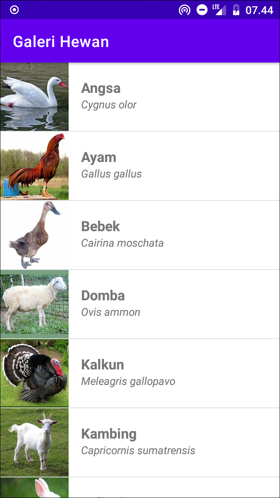
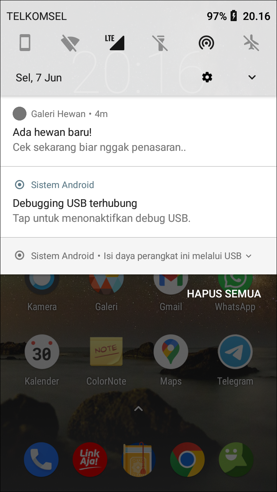

# Galeri Hewan

Aplikasi Android sederhana yang menampilkan list hewan menggunakan RecyclerView. Data hewan berasal dari static API. Terdapat juga background proses yang akan memberi tahu pengguna ada data baru menggunakan notifikasi.

Tampilan Utama                              | Tampilan Notifikasi
--------------------------------------------|---------------------------------------------
|

Punya pertanyaan atau masukan? Silahkan disampaikan melalui issue repository ini.

## Lisensi

    Copyright (c) 2021 Indra Azimi. All rights reserved.

    Dibuat untuk kelas Pemrograman untuk Perangkat Bergerak 1.
    Dilarang melakukan penggandaan dan atau komersialisasi,
    sebagian atau seluruh bagian, baik cetak maupun elektronik
    terhadap project ini tanpa izin pemilik hak cipta.